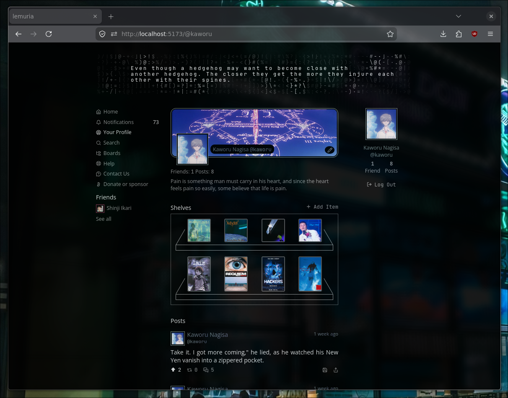

# Lemuria

**Lemuria** is a social platform built around two-sided friendships, shelves,
and topic-based boards. Inspired by Letterboxd and early Facebook.

- **Shelves** provide a way to share what you're currently reading, watching, or
  listening to. This makes for expressive user profiles you want to share, and
  also sparks discussions around those interests.

- **Boards** provide a means for discovery and organic conversations.

- **Two-sided friendships** are an alternative to the typical follower model,
  and help to encourage thoughtful conversations within small, genuine
  communities.

## Tech Stack

- **Frontend:** SvelteKit, Svelte 5, Typescript

- **Backend:** Hono, Bun, Drizzle ORM

- **Database:** SQLite (migrating to Turso on deployment)

The codebase prioritises type safety and clean architecture throughout.

## Current Status

Lemuria is approaching deployment,
see [TASKS.md](../TASKS.md) for the full development roadmap.
