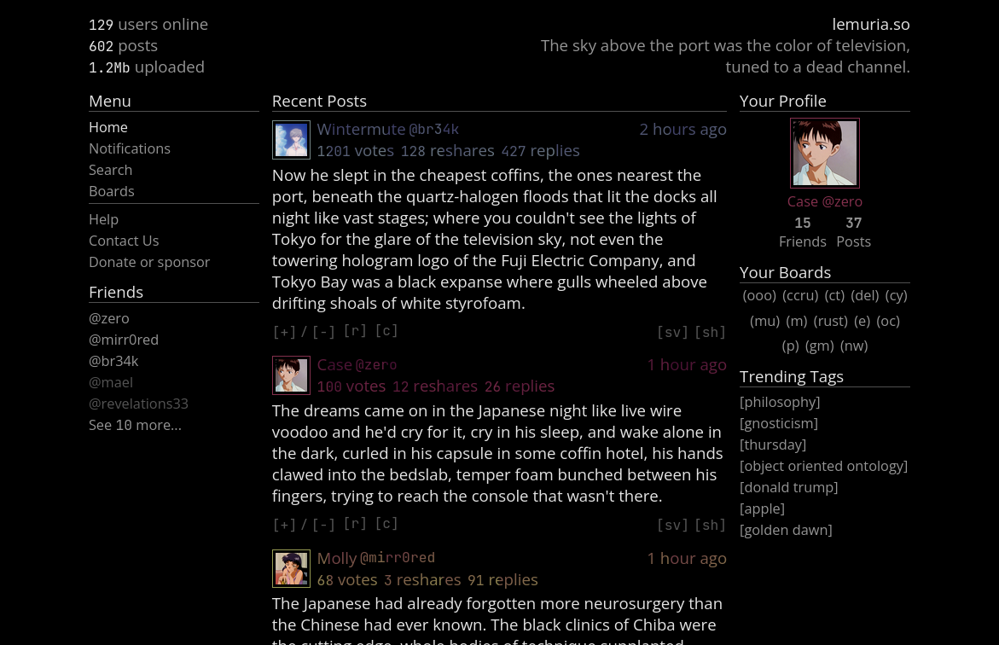

# Lemuria

**Lemuria** is a discussion platform built with a focus on thoughtful
conversations within small, genuine communities. Rather than the typical
follower model, Lemuria emphasises two-sided friendships. Shelves provide a
way to share what you're currently reading, watching, or listening to. This
makes for expressive user profiles, and sparks discussions around those
interests. Meanwhile, boards provide a means for discovery and organic
conversations.

Lemuria adopts a minimal, lainchan-inspired, dark-mode-first aesthetic with
an almost terminal feel.

## Tech Stack

- **Frontend:** SvelteKit, Svelte 5, Typescript

- **Backend:** Hono, Bun, Drizzle ORM

- **Database:** SQLite (migrating to Turso on deployment)

The codebase prioritises type safety and clean architecture throughout.

## Current Status

**Completed:** Posts, friend requests and management, notifications,
authentication and user accounts.

**In Progress:** Profile pages and customisation, shelves, and sidebars.

**Upcoming:** Boards, comments, likes, reposts, search, essay posts, and more.

See [TASKS.md](./TASKS.md) for the full development roadmap.
